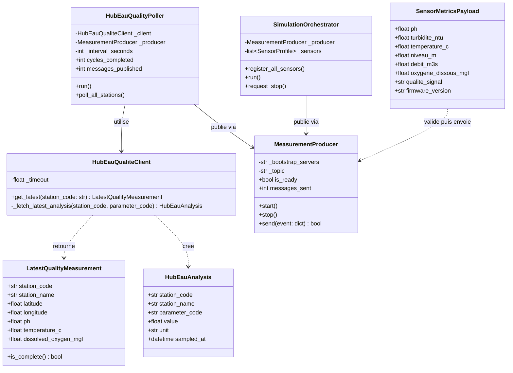

# Diagramme de Classes UML — iot-service

Le diagramme ci-dessous illustre la structure des classes et des composants cles du microservice `iot-service`.

```mermaid
classDiagram
    class HubEauQualiteClient {
        -float _timeout
        +get_latest(station_code: str) LatestQualityMeasurement
        -_fetch_latest_analysis(station_code, parameter_code) HubEauAnalysis
    }

    class HubEauQualityPoller {
        -HubEauQualiteClient _client
        -MeasurementProducer _producer
        -int _interval_seconds
        +int cycles_completed
        +int messages_published
        +run()
        +poll_all_stations()
    }

    class SimulationOrchestrator {
        -MeasurementProducer _producer
        -list~SensorProfile~ _sensors
        +register_all_sensors()
        +run()
        +request_stop()
    }

    class MeasurementProducer {
        -str _bootstrap_servers
        -str _topic
        +bool is_ready
        +int messages_sent
        +start()
        +stop()
        +send(event: dict) bool
    }

    class SensorMetricsPayload {
        +float ph
        +float turbidite_ntu
        +float temperature_c
        +float niveau_m
        +float debit_m3s
        +float oxygene_dissous_mgl
        +str qualite_signal
        +str firmware_version
    }

    class LatestQualityMeasurement {
        +str station_code
        +str station_name
        +float latitude
        +float longitude
        +float ph
        +float temperature_c
        +float dissolved_oxygen_mgl
        +is_complete() bool
    }

    class HubEauAnalysis {
        +str station_code
        +str station_name
        +str parameter_code
        +float value
        +str unit
        +datetime sampled_at
    }

    HubEauQualityPoller --> HubEauQualiteClient : utilise
    HubEauQualityPoller --> MeasurementProducer : publie via
    SimulationOrchestrator --> MeasurementProducer : publie via
    HubEauQualiteClient ..> LatestQualityMeasurement : retourne
    HubEauQualiteClient ..> HubEauAnalysis : cree
    SensorMetricsPayload ..> MeasurementProducer : valide puis envoie
```
