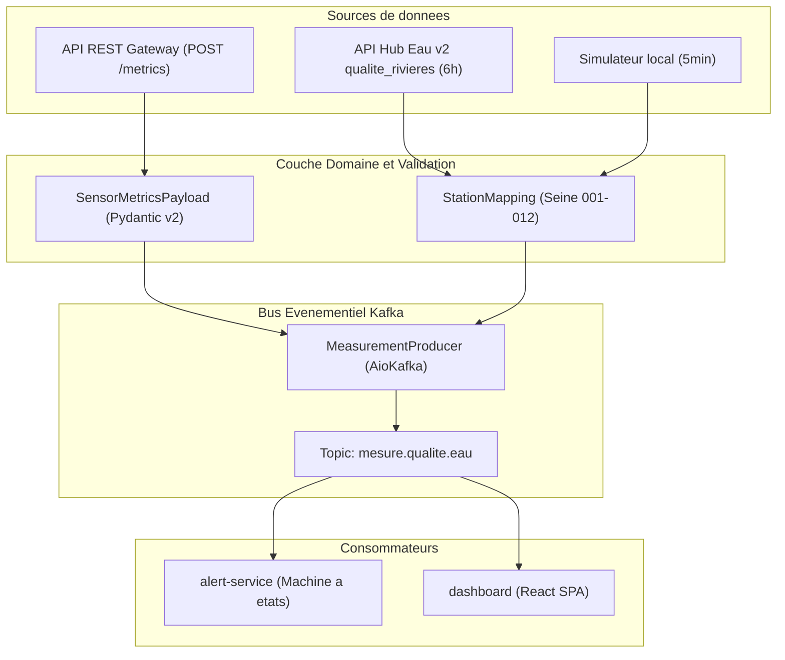
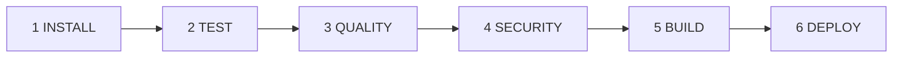

# Diagramme de Flux de Donnees — Architecture iot-service

Vue d'ensemble du flux de donnees depuis les sources jusqu'au bus Kafka.

```mermaid
graph TD
    subgraph Sources ["Sources de donnees"]
        HubEau["API Hub Eau v2 qualite_rivieres (6h)"]
        Simulateur["Simulateur local (5min)"]
        REST["API REST Gateway (POST /metrics)"]
    end

    subgraph Domain ["Couche Domaine et Validation"]
        Pydantic["SensorMetricsPayload (Pydantic v2)"]
        StationMap["StationMapping (Seine 001-012)"]
    end

    subgraph EventBus ["Bus Evenementiel Kafka"]
        Producer["MeasurementProducer (AioKafka)"]
        Topic["Topic: mesure.qualite.eau"]
    end

    subgraph Consumers ["Consommateurs"]
        Alert["alert-service (Machine a etats)"]
        Dashboard["dashboard (React SPA)"]
    end

    HubEau --> StationMap
    Simulateur --> StationMap
    REST --> Pydantic
    Pydantic --> Producer
    StationMap --> Producer
    Producer --> Topic
    Topic --> Alert
    Topic --> Dashboard
```

# Diagramme du Pipeline CI/CD — 6 Etapes Bloquantes

```mermaid
graph LR
    S1["1 INSTALL"] --> S2["2 TEST"]
    S2 --> S3["3 QUALITY"]
    S3 --> S4["4 SECURITY"]
    S4 --> S5["5 BUILD"]
    S5 --> S6["6 DEPLOY"]
```
