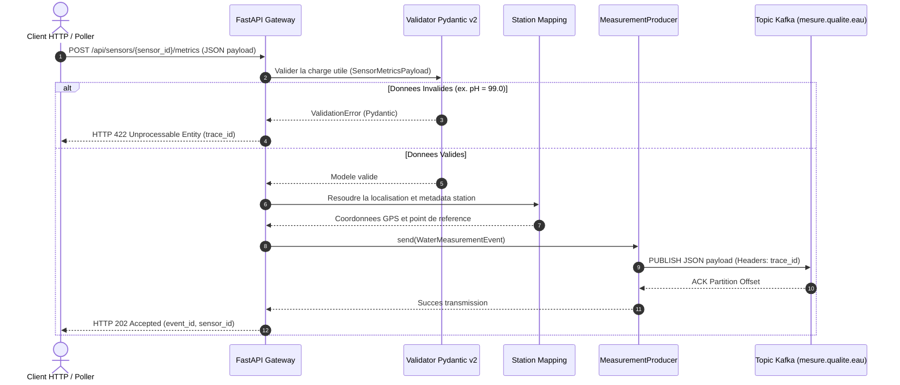

# Diagramme de Sequence UML — Flux d'ingestion iot-service

Le diagramme de sequence suivant decrit le parcours complet d'une metrique recue via l'API REST ou le Poller Hub'Eau jusqu'a sa publication sur Kafka.

