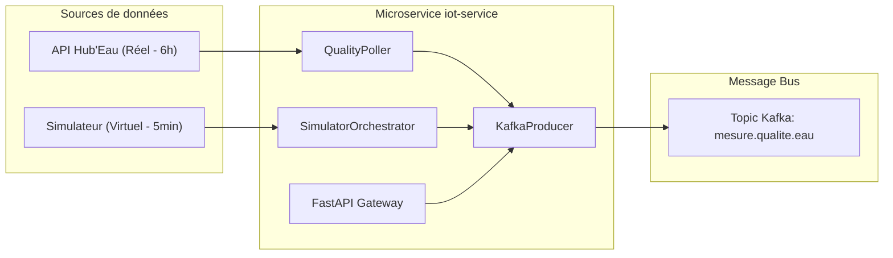

# Portail de Documentation — UrbanHub `iot-service`

> Bienvenue sur le portail de documentation technique **Doc-as-Code** du microservice d'ingestion de la qualité de l'eau **UrbanHub**.

---

## Aperçu du Microservice

Le microservice `iot-service` constitue la porte d'entrée de données pour la plateforme Smart City UrbanHub. Il est responsable de la collecte, de la normalisation et de la diffusion en temps réel des mesures physico-chimiques des cours d'eau (bassin de la Seine).

---

## Naviguer dans la Documentation (Modèle Diátaxis)

La documentation est organisée selon la méthodologie internationale **Diátaxis** en 4 axes complémentaires :

| Axe | Page | Objectif | Public visé |
|-----|------|----------|-------------|
| **1. Apprentissage** | [Prise en main (Tutoriel)](tutorial.md) | Guide pas-à-pas pour installer et lancer le service en 5 minutes. | Nouveau développeur |
| **2. Résolution de tâches** | [Guides Pratiques](how-to-guides.md) | Déploiement Docker, exécution des tests et opérations courantes. | Développeur / Ops |
| **3. Information technique** | [Référence Technique](reference.md) | Spécifications API REST, Pydantic v2, CLI, variables d'environnement. | Développeur / Intégrateur |
| **4. Compréhension** | [Architecture & Conception](explanation.md) | Principes SOLID, DDD, diagrammes UML Mermaid.js (Classes & Séquence). | Architecte / Lead Dev |

---

## Qualité, Sécurité & Exploitation

- **[CI/CD & DevSecOps](security-and-cicd.md)** : Explication du pipeline 6 étapes et restitution des scans (Gitleaks, Bandit, Trivy, CycloneDX SBOM).
- **[Dépannage (Troubleshooting)](troubleshooting.md)** : Matrice des 5 incidents fréquents et leurs résolutions pas-à-pas.
- **[Maintenance & Changelog](maintenance-changelog.md)** : Guide d'évolution du service et historique des versions.
- **[Synthèse Client (BLUF)](client-summary.md)** : Synthèse décisionnelle vulgarisée, bénéfices métiers et impacts écologiques/financiers.
