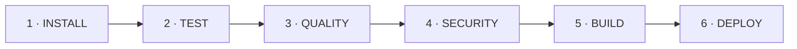

# Pipeline CI/CD & Sécurité DevSecOps

> **Objectif** : Expliquer l'architecture du pipeline CI/CD séquentiel et bloquant (6 étapes) et détailler la politique d'analyse de sécurité DevSecOps.

---

## Architecture du Pipeline CI/CD (6 Étapes Bloquantes)

Le pipeline `.github/workflows/ec03-iot-service.yml` (et sa copie `01_pipeline.yml`) implémente une chaîne d'intégration continue stricte et 100 % séquentielle :



### Rôle et garanties de chaque étape

| Étape | Nom | Rôle & Commandes exécutées | Gate d'Échec (Bloquant) |
|-------|-----|----------------------------|--------------------------|
| **1** | **INSTALL** | Résolution déterministe via `uv sync --frozen`. | Échec d'installation des dépendances lockfile. |
| **2** | **TEST** | Exécution des tests unitaires et non-fonctionnels (`pytest --cov=src`). | Au moins 1 test échoué ou couverture < 50 %. |
| **3** | **QUALITY** | Verification du style et du typage (`ruff check`, `ruff format`, `mypy src/`). | Violation des règles Ruff ou erreur Mypy. |
| **4** | **SECURITY** | Scans SAST, SCA, secrets et génération SBOM. | Secret détecté, vulnérabilité Trivy CRITICAL ou faille Bandit non neutralisée. |
| **5** | **BUILD** | Construction de l'image Docker multi-stage et vérification `USER` non-root. | Échec du build ou conteneur s'exécutant en root. |
| **6** | **DEPLOY** | Lancement autonome `docker run` + exécution de `smoke_test.sh`. | Endpoint `/health` injoignable ou HTTP status ≠ 200. |

---

## Outillage DevSecOps & Restitution des Scans

### 1. Détection de Secrets — Gitleaks

- **Rôle** : Détection des clés API, mots de passe, tokens JWT ou clés privées dans tout l'historique Git.
- **Commande** : `gitleaks-action@v2`
- **Résultat** : `0 leaks found` (0 secret détecté).

---

### 2. SAST (Static Application Security Testing) — Bandit

- **Rôle** : Analyse statique du code source Python à la recherche de failles de sécurité (injections, faiblesse cryptographique, appels système à risque).
- **Commande** : `uv run bandit -r src/ -ll`
- **Analyse & Décision DevSecOps** :
 - L'analyseur a levé une alerte de sévérité Medium `B310` sur la fonction `urllib.request.urlopen` au niveau de `hubeau_qualite_client.py`.
 - **Décision** : Après audit du code, il a été vérifié que l'URL d'appel est construite de façon déterministe en préfixant l'URL par la constante officielle `_BASE_URL = "https://hubeau.eaufrance.fr/api/v2/qualite_rivieres/analyse_pc"`.
 - Le tag de contournement légitime `# nosec B310` a été apposé sur la ligne pour neutraliser ce faux positif sans affaiblir la sécurité.
- **Résultat** : `0 issue` (Medium/High) retenue.

---

### 3. SCA (Software Component Analysis) — Trivy Filesystem Scan

- **Rôle** : Analyse des vulnérabilités connues (CVE) au niveau des paquets de dépendances Python (`uv.lock`) et du système de fichiers.
- **Commande** : `aquasecurity/trivy-action@master` (`scan-type: fs`, `severity: CRITICAL`, `exit-code: 1`)
- **Résultat** : `0 CRITICAL vulnerability` (Porte de sécurité 100 % validée).

---

### 4. SBOM (Software Bill of Materials) — CycloneDX

- **Rôle** : Génération de l’inventaire numéroté et normé de tous les composants logiciels de l'application pour garantir la traçabilité.
- **Format** : Specification CycloneDX v1.4 JSON.
- **Artefact produit** : `sbom-iot-service.json`.

---

## Sécurité du Runtime Conteneurisé (Image Non-Root)

Pour interdire l'élévation de privilèges dans le conteneur en production, le Dockerfile utilise un utilisateur dédié non-privilégié (`appuser`) :

```dockerfile
# Extrait Dockerfile multi-stage
RUN addgroup --system appuser && adduser --system --group appuser
USER appuser
```

**Vérification automatique dans le pipeline (Job 5 BUILD)** :

```bash
USER=$(docker inspect --format='{{.Config.User}}' urbanhub/iot-service:ec03-local)
test -n "$USER" && test "$USER" != "root" && test "$USER" != "0"
```
