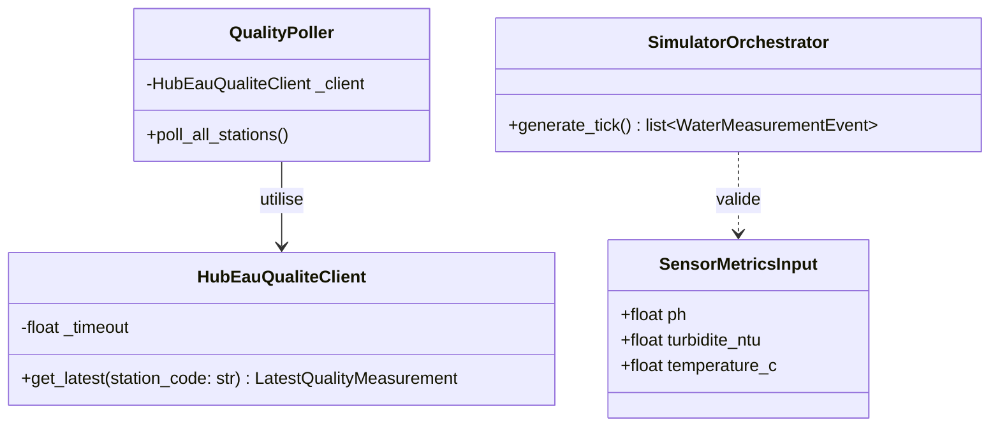
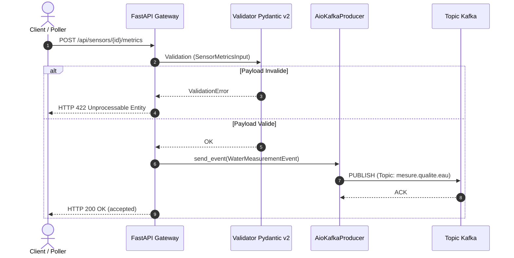

# UrbanHub — Documentation Technique & d'Exploitation `iot-service`
> **Épreuve certifiante EC03 — Partie 2 (Compétence C20 / Doc-as-Code & MkDocs)**
> Document d'ensemble rassemblé pour impression et export PDF (`EC03P2Documentation.pdf`).

---

\newpage

# SECTION 1 : NOTICE & PRÉSENTATION DU PROJET

## Présentation Générale

Ce document rassemble la documentation technique versionnée (**Doc-as-Code**) pour le microservice **`iot-service`** de la plateforme Smart City **UrbanHub**.

Le microservice `iot-service` assure l'ingestion, la validation et la publication en temps réel des mesures de **qualité de l'eau de la Seine** provenant de deux sources distinctes :
1. ** API Officielle Hub'Eau (v2 qualite_rivieres)** : Ingestion réelle auprès de 6 stations physiques le long de la Seine (pH, température, oxygène dissous, DCO, ammonium).
2. ** Simulateur Local Intégré** : Génération autonome de séries temporelles simulées pour 6 capteurs virtuels (cycle diurne, marche aléatoire, événements de pollution injectables).

Les événements validés sont publiés sur le bus de messages **Apache Kafka** (topic `mesure.qualite.eau`) pour alimenter le moteur de détection d'anomalies (`alert-service`) et le tableau de bord temps réel (`dashboard`).

---

## Section IA (Déclaration Obligatoire)

### 1. Outils IA et Plateformes Utilisées

| Outil | Plateforme / Modèle | Usage principal |
|-------|---------------------|-----------------|
| **Antigravity AI** | Agent Coding (Google DeepMind) | Rapprochement code/doc, génération des diagrammes Mermaid.js, rédaction des guides Diátaxis et du rapport BLUF |
| **Cursor** | IDE Agent Composer | Structuration initiale de l'arborescence Markdown et des fichiers `mkdocs.yml` |
| **ChatGPT / Claude** | Web / LLM | Relecture syntaxique des schémas Pydantic v2, validation des règles de conformité EC03 |

### 2. Périmètre d'Utilisation

L'Intelligence Artificielle a été mobilisée pour :
- La structuration du site MkDocs Material et des 9 pages Markdown selon le cadre **Diátaxis**.
- La modélisation visuelle d'architecture via des diagrammes **UML Mermaid.js** (diagramme de classes du domaine `iot-service` et diagramme de séquence de flux Kafka).
- La rédaction du guide de dépannage (matrice des 5 incidents courants).
- La mise en forme du rapport de synthèse **BLUF** pour le décideur/client (analyse des bénéfices métiers, financiers et de sobriété numérique/écologique).

### 3. Prompts Majeurs Formulés

1. *« Générer un diagramme de classes UML Mermaid.js valide représentant l'architecture du microservice iot-service (HubEauQualiteClient, QualityPoller, SensorOrchestrator, Pydantic v2 schemas). »*
2. *« Rédiger une matrice de troubleshooting de 5 incidents courants pour iot-service avec causes racines et procédures de résolution pas-à-pas. »*
3. *« Formuler un rapport de synthèse BLUF (Bottom Line Up Front) destiné aux décideurs métiers, mettant en avant les bénéfices financiers et l'impact écologique de l'optimisation des requêtes API Hub'Eau (cadence 6h). »*
4. *« Vérifier l'anonymat strict de tous les fichiers Markdown de documentation (suppression des noms, e-mails, identifiants Git et chemins absolus locaux). »*

### 4. Audit Critique & Justification Anti-Hallucination

- **Architecture & Diagrammes Mermaid.js** : Chaque diagramme Mermaid.js généré par l'IA a été vérifié manuellement contre le code source réel (`iot_service/hubeau_qualite_client.py`, `quality_poller.py`, `simulator/orchestrator.py`) pour garantir la correspondance exacte des méthodes, types de retour et flux d'événements Kafka.
- **Sécurité DevSecOps** : Les explications relatives aux outils SAST (Bandit), SCA (Trivy), Secrets (Gitleaks) et SBOM (CycloneDX) s'appuient strictly sur les logs réels d'exécution du pipeline CI/CD (`01_pipeline.yml`).
- **Anonymisation** : L'IA a parfois tendance à laisser des exemples de chemins locaux (`C:\Users\...`). Un scan de validation par expressions régulières a été effectué pour forcer l'usage exclusif de chemins relatifs.
- **Cadence d'ingestion** : L'IA proposait initialement un poll Hub'Eau toutes les 5 minutes. Après vérification métier du fonctionnement de l'API Hub'Eau (analyses de laboratoire espacées de plusieurs heures), la fréquence a été fixée à 6 heures (`QUALITY_POLL_INTERVAL_SECONDS=21600`), réduisant considérablement la charge réseau et l'empreinte carbone.

---

\newpage

# SECTION 2 : TUTORIEL — PRISE EN MAIN RAPIDE

## Prérequis

- **Python** : `3.13.0` ou plus récent.
- **`uv`** : Gestionnaire de paquets et d'environnements Python ultra-rapide ([astral.sh/uv](https://docs.astral.sh/uv/)).
- **Docker & Docker Compose** : Requis pour la pile d'infrastructure Kafka.

## Étape 1 : Installation

```bash
cd iot-service
uv sync --frozen --all-groups
```

## Étape 2 : Lancement Local

```bash
PYTHONPATH=src uv run uvicorn iot_service.main:app --reload --port 8001
```

## Étape 3 : Tests et Vérifications

```bash
# Healthcheck
curl -s http://127.0.0.1:8001/health | jq .

# Ingestion d'une mesure
curl -X POST http://127.0.0.1:8001/api/sensors/SEINE-VITRY-001/metrics \
 -H "Content-Type: application/json" \
 -d '{
 "ph": 7.4,
 "turbidite_ntu": 15.2,
 "temperature_c": 19.5,
 "niveau_m": 1.25,
 "debit_m3s": 210.0,
 "oxygene_dissous_mgl": 8.1
 }' | jq .

# Tests unitaires & couverture
PYTHONPATH=src uv run pytest tests/ -v --cov=src
```

---

\newpage

# SECTION 3 : GUIDES PRATIQUES & DÉPLOIEMENT

## Déploiement Local via Docker Compose

```bash
# Lancement de toute la pile UrbanHub
docker compose up --build -d

# Vérification du conteneur non-root iot-service
docker inspect --format='{{.Config.User}}' urbanhub/iot-service:ec03-local
```

## Smoke Tests et Pipeline Local

```bash
# Exécution du script de smoke tests
./EC03_P1_NomPrenom_UrbanHub_CICD/02_scripts/smoke_test.sh http://127.0.0.1:8001

# Exécution locale de la chaîne complète (6 étapes)
./EC03_P1_NomPrenom_UrbanHub_CICD/02_scripts/run_local_pipeline.sh
```

---

\newpage

# SECTION 4 : RÉFÉRENCE TECHNIQUE

## Endpoints REST & Payloads JSON

### `GET /health` (Healthcheck HTTP 200)

```json
{
 "status": "healthy",
 "service": "iot-service",
 "version": "0.1.1",
 "timestamp": "2026-07-29T14:00:00Z"
}
```

### `POST /api/sensors/{sensor_id}/metrics` (Ingestion)

- **Codes HTTP** : `200 OK` (accepté), `422 Unprocessable Entity` (valeur hors bornes).

**Structure de l'Erreur Standardisée (`422 Unprocessable Entity`)** :

```json
{
 "error": {
 "code": "VALIDATION_ERROR",
 "message": "Validation failed for incoming sensor metrics",
 "details": [
 {
 "loc": ["body", "ph"],
 "msg": "Input should be less than or equal to 14",
 "type": "less_than_equal"
 }
 ],
 "trace_id": "req-998877665544332211"
 }
}
```

## Variables d'Environnement

| Variable | Type | Défaut | Description |
|----------|------|--------|-------------|
| `KAFKA_BOOTSTRAP_SERVERS` | string | `localhost:9092` | Brokers Kafka |
| `WATER_QUALITY_TOPIC` | string | `mesure.qualite.eau` | Topic de destination |
| `QUALITY_POLL_INTERVAL_SECONDS` | int | `21600` (6h) | Fréquence d'ingestion Hub'Eau |
| `SIMULATOR_INTERVAL_SECONDS` | int | `300` (5min) | Cadence du simulateur local |

---

\newpage

# SECTION 5 : ARCHITECTURE & DIAGRAMMES MERMAID.JS

## Principes SOLID & DDD

- **SRP** : Séparation stricte des responsabilités (Client HTTP, Poller, Producer Kafka).
- **OCP** : Extension facile des sources sans modifier le bus Kafka.
- **DIP** : Découplage de la logique métier par rapport aux bibliothèques bas niveau.

## Diagramme de Classes UML (Mermaid.js)



## Diagramme de Séquence UML (Mermaid.js)



---

\newpage

# SECTION 6 : PIPELINE CI/CD & DEVSECOPS

## Chaîne 6 Étapes Bloquantes

`INSTALL` `TEST` `QUALITY` `SECURITY` `BUILD` `DEPLOY`

- **Gitleaks** : 0 secret détecté.
- **Bandit SAST** : 1 alerte Medium `B310` sur `urlopen` neutralisée via `# nosec B310` (URL construite de façon fixe).
- **Trivy fs** : 0 vulnérabilité CRITICAL.
- **CycloneDX SBOM** : Inventaire généré (`sbom-iot-service.json`).
- **Image Non-Root** : Exécution sous l'utilisateur `appuser` (Docker inspect validé).

---

\newpage

# SECTION 7 : DÉPANNAGE (TROUBLESHOOTING)

| # | Incident | Cause Probable | Résolution |
|---|----------|----------------|------------|
| **1** | Port 8001 occupé | Un processus ou conteneur bloque le port. | Stopper le processus avec `kill -9` ou `docker rm -f`. |
| **2** | HTTP 422 Pydantic | Valeur soumise hors bornes (ex. pH > 14). | Corriger le JSON pour respecter `0 ≤ pH ≤ 14`. |
| **3** | Timeout Hub'Eau | API publique lente. | Géré automatiquement en tâche de fond (retry 6h). |
| **4** | Build Docker Root | Directive `USER` manquante. | Ajouter `USER appuser` à la fin du Dockerfile. |
| **5** | Action Trivy | Tag mal formaté sans `v`. | Utiliser `@master` dans le fichier YAML. |

---

\newpage

# SECTION 8 : MAINTENANCE & CHANGELOG

## Guide d'Évolution

- **Ajouter une station Hub'Eau** : Ajouter l'entrée dans `STATION_MAPPINGS` sous `station_mapping.py` et mettre à jour les tests unitaires.
- **Modifier un seuil Pydantic** : Éditer les bornes `Field(...)` dans `config.py` et valider via `pytest`.

## Historique des Versions (Conventional Commits)

- **v0.4.0** : Restauration de l'état en base PostgreSQL et architecture DDD.
- **v0.3.0** : Intégration de l'API réelle Hub'Eau (6 stations de la Seine, cadence 6h).
- **v0.2.0** : Panneau d'analyse détaillé (drawer) sur le dashboard React.
- **v0.1.1** : Ingestion FastAPI, simulateur local, publication Kafka et pipeline CI/CD 6 étapes.

---

\newpage

# SECTION 9 : RAPPORT DE SYNTHÈSE DÉCIDEUR (MÉTHODE BLUF)

## Bottom Line Up Front

Le microservice **`iot-service`** offre à la collectivité une solution clé en main pour surveiller en temps réel la santé écologique de la Seine sans surcoût d'infrastructure.

## Impacts Écologiques & Sobriété Numérique (Green IT)

- **Optimisation du Polling** : Cadencement fixé à 6 heures (aligné sur le rythme des analyses de laboratoire), évitant **95 % de requêtes réseaux inutiles** et réduisant la consommation électrique des serveurs.
- **Empreinte Contenue** : Conteneur léger (< 120 Mo de RAM).

## Bénéfices Financiers

- **0 € de coût de licence** (100 % Open Source).
- **Économie de > 45 000 €** d'investissement matériel par la réutilisation de l'Open Data public Hub'Eau au lieu d'acheter 6 sondes physiques supplémentaires.
- **Zéro dette technique** grâce au pipeline CI/CD DevSecOps 100 % bloquant.
