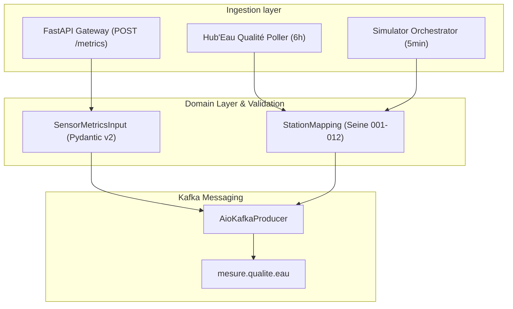
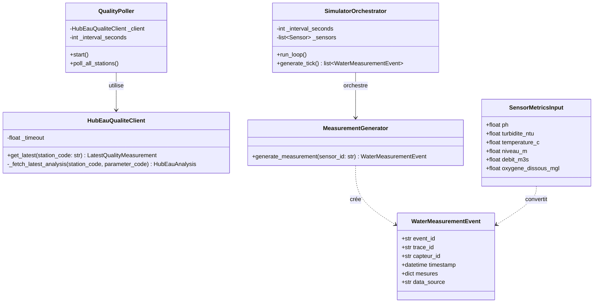
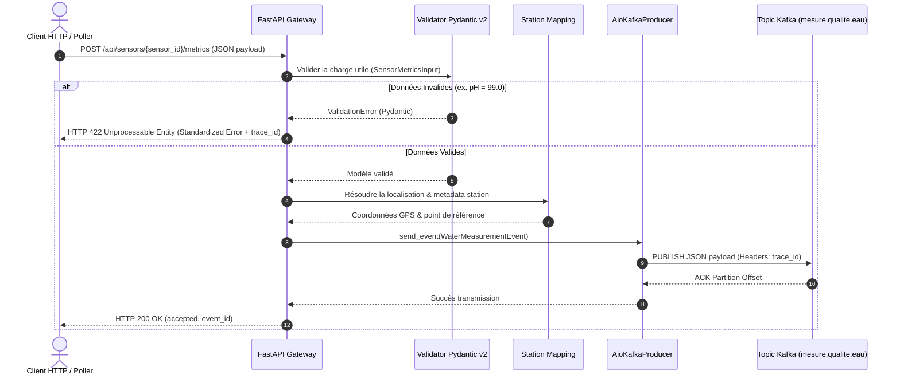

# 🏛️ Architecture & Choix de Conception

> **Objectif** : Expliquer les principes fondateurs de l'architecture du microservice `iot-service`, le respect des règles SOLID, du Domain-Driven Design (DDD) et illustrer les flux via des diagrammes UML Mermaid.js.

---

## 🎯 Vue d'Ensemble & Découpage

Le microservice `iot-service` agit en tant que **Producteur Événementiel Pur**. Il orchestre l'ingestion sans état (stateless) et la publication des événements de qualité de l'eau.

---

## 📐 Principes SOLID appliqués

- **Single Responsibility Principle (SRP)** :
  - `HubEauQualiteClient` ne gère que les requêtes HTTP et le découpage JSON de l'API Hub'Eau.
  - `QualityPoller` s'occupe uniquement du cadencement d'interrogation (background task 6h).
  - `KafkaProducer` gère exclusivement la connexion et la sérialisation Kafka.
- **Open/Closed Principle (OCP)** :
  - Le système d'ingestion est ouvert à l'ajout de nouvelles sources (ex. un nouveau capteur ou API météo) sans modifier le moteur de publication Kafka.
- **Liskov Substitution Principle (LSP)** :
  - Les événements générés par le simulateur local ou issus de l'API réelle Hub'Eau respectent exactement le même modèle de domaine `WaterMeasurementEvent`.
- **Interface Segregation Principle (ISP)** :
  - Les clients interagissent avec des interfaces restreintes (ex. l'API REST FastAPI n'expose que les endpoints nécessaires sans révéler l'implémentation interne Kafka).
- **Dependency Inversion Principle (DIP)** :
  - La logique métier ne dépend pas directement des détails d'implémentation bas niveau (`urllib` ou `aiokafka`), mais d'abstractions de modèles.

---

## 📊 Diagramme de Classes UML (Mermaid.js)

Le diagramme ci-dessous illustre la structure des classes et des composants clés de `iot-service` :

---

## 🔄 Diagramme de Séquence UML (Mermaid.js)

Le diagramme de séquence suivant décrit le parcours complet d'une métrique reçue via l'API REST ou le Poller jusqu'à sa publication sur Kafka :

---

## 💡 Choix Techniques & Arbitrages

1. **Fusion du Simulateur dans `iot-service`** :
   - *Motivation* : Éliminer la complexité opérationnelle d'un conteneur simulateur séparé. Les tâches de fond `lifespan` FastAPI gèrent désormais à la fois le Poller Hub'Eau (6h) et le Simulateur (5min) au sein de la même instance Python.
2. **Standardisation Pydantic v2 & `trace_id`** :
   - *Motivation* : Garantie de la robustesse des données entrantes. Chaque événement transporte un `trace_id` propagé dans les en-têtes Kafka et les réponses HTTP pour assurer la traçabilité end-to-end de l'observabilité.
