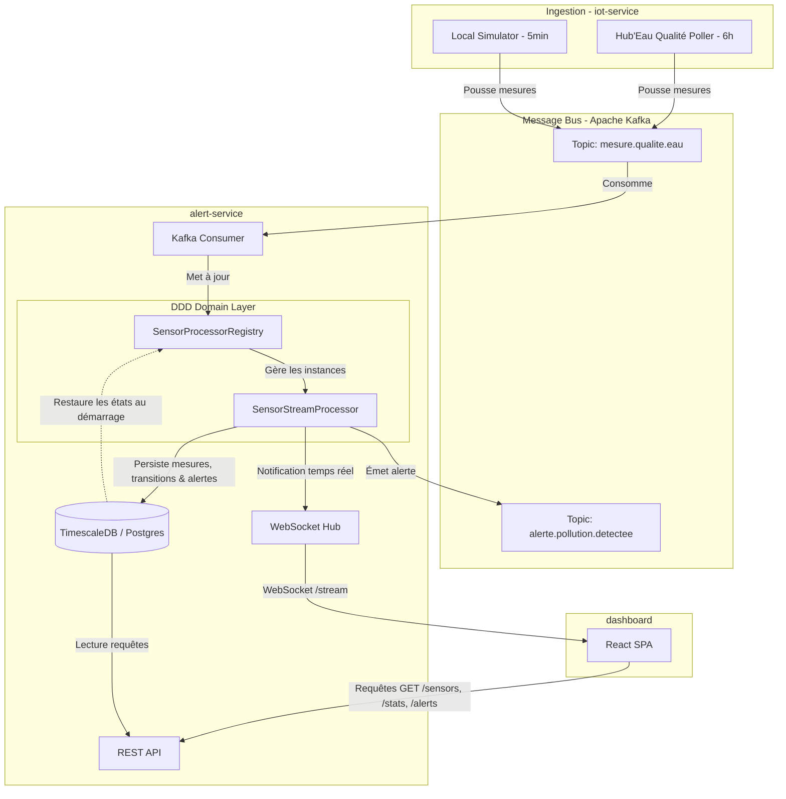

# 🌊 UrbanHub — Smart City Water Quality Platform

> **Distributed event-driven platform** for monitoring water quality along the Seine.
> Real ingestion (Hub'Eau API) + local simulator, state-machine-based anomaly detection, real-time WebSocket dashboard, full persistence in TimescaleDB.

[](https://www.python.org/)
[](https://react.dev/)
[](https://fastapi.tiangolo.com/)
[](https://kafka.apache.org/)
[](https://www.timescale.com/)
[](LICENSE)

---

## 🎯 What is UrbanHub?

UrbanHub is a **proof-of-concept Smart City platform** built as the final-year project for the **Master EADL** (Expert en Architecture et Développement Logiciel). It demonstrates how to design and implement a complete distributed system with realistic concerns:

- ✅ **Event-driven** architecture (Kafka KRaft, no Zookeeper)
- ✅ **State machine** for anomaly detection (NORMAL → WARNING → CRITICAL with hysteresis, 3-consecutive-anomalies rule)
- ✅ **Repository pattern** (asyncpg, swap-able in tests)
- ✅ **Persistence** in PostgreSQL + TimescaleDB (hypertable for time-series + continuous aggregates)
- ✅ **Real-time push** via WebSocket to a SPA dashboard
- ✅ **Drill-down** drawer per sensor (chart 24h + table + alerts)
- ✅ **Real data + simulation** coexisting (6 stations Hub'Eau + 6 simulated sensors)
- ✅ **Standardized errors**, OpenAPI contract, trace_id propagated end-to-end
- ✅ **Monitoring** stack (Prometheus, Grafana, Loki, Promtail)
- ✅ **CI/CD** with GitHub Actions (lint, test, security scan, Docker build)
- ✅ **Container-native** deployment via docker-compose

The case study focuses on **water quality** (12 sensors along the Seine), but the architecture is designed to extend to other Smart City domains (traffic, noise, energy).

---

## 🏛️ Architecture



---

## 📦 Services

| Service | Port | Tech | Role |
|---------|:----:|------|------|
| **dashboard** | 5173 | React 19 + Vite + Tailwind + Leaflet + Recharts | Real-time SPA + drill-down |
| **alert-service** | 8000 | FastAPI + asyncpg + aiokafka | DDD State machine + REST + WS + State recovery |
| **iot-service** | 8001 | FastAPI + urllib + aiokafka | Kafka Producer - Hub'Eau (6h) + Simulator (5min) (health checks only) |
| **postgres** | 5432 | TimescaleDB (PG16) | Persistence (hypertable) |
| **kafka** | 9092 | Apache Kafka 3.7 (KRaft) | Event bus |
| **kafka-ui** | 8080 | kafbat/kafka-ui | Kafka web UI |
| **prometheus** | 9090 | prom/prometheus | Metrics |
| **grafana** | 3000 | grafana/grafana | Dashboards |
| **loki** | 3100 | grafana/loki | Logs |
| **promtail** | — | grafana/promtail | Docker log shipping |

> **One iot-service to rule them all** — both real Hub'Eau ingestion and the local simulator live in the same FastAPI app. Two background tasks started in `lifespan`: one polls Hub'Eau every 6h, the other runs the simulator every 5min.

---

## 🚀 Quick start

### Prerequisites

- Docker + Docker Compose v2
- (Optional, for local dev) Python 3.13+, Node 20+, `uv`

### Launch the full stack

```bash
git clone <repo>
cd xtreme-programming
docker compose up --build -d
```

Wait ~60 seconds for all services to start. Then:

| URL | What |
|-----|------|
| <http://localhost:5173> | **Dashboard** (the main UI) |
| <http://localhost:8000/docs> | alert-service Swagger UI |
| <http://localhost:8001/docs> | iot-service Swagger UI |
| <http://localhost:8080> | Kafka UI |
| <http://localhost:3000> | Grafana (admin / admin) |

### Verify everything is working

```bash
# Health check
curl http://localhost:5173/api/stats
# → { "sensors_total": 12, "sensors_by_state": {NORMAL, WARNING, CRITICAL}, ... }

# Inject high-frequency / custom events directly via Kafka console producer
# (or use Kafka UI at http://localhost:8080 to publish a message)
docker compose exec -T kafka kafka-console-producer.sh \
  --bootstrap-server localhost:9092 \
  --topic mesure.qualite.eau <<EOF
{"event_type": "mesure.qualite.eau", "event_id": "550e8400-e29b-41d4-a716-446655440000", "trace_id": "demo-trace-id", "capteur_id": "SEINE-COLOMBES-012", "timestamp": "2026-07-02T12:00:00Z", "localisation": {"latitude": 48.9135, "longitude": 2.2546, "point_reference": "Colombes"}, "mesures": {"ph": 4.0, "turbidite_ntu": 85.0, "temperature_c": 19.5, "niveau_m": 1.2, "debit_m3s": 210.0, "oxygene_dissous_mgl": 3.2}, "qualite_signal": "GOOD", "firmware_version": "2.4.1", "data_source": "simulated"}
EOF

# Inject two more anomalous messages for Colombes to trigger warning -> critical state machine transition
docker compose exec -T kafka kafka-console-producer.sh \
  --bootstrap-server localhost:9092 \
  --topic mesure.qualite.eau <<EOF
{"event_type": "mesure.qualite.eau", "event_id": "550e8400-e29b-41d4-a716-446655440001", "trace_id": "demo-trace-id", "capteur_id": "SEINE-COLOMBES-012", "timestamp": "2026-07-02T12:05:00Z", "localisation": {"latitude": 48.9135, "longitude": 2.2546, "point_reference": "Colombes"}, "mesures": {"ph": 4.0, "turbidite_ntu": 90.0, "temperature_c": 19.5, "niveau_m": 1.2, "debit_m3s": 210.0, "oxygene_dissous_mgl": 3.0}, "qualite_signal": "GOOD", "firmware_version": "2.4.1", "data_source": "simulated"}
EOF

docker compose exec -T kafka kafka-console-producer.sh \
  --bootstrap-server localhost:9092 \
  --topic mesure.qualite.eau <<EOF
{"event_type": "mesure.qualite.eau", "event_id": "550e8400-e29b-41d4-a716-446655440002", "trace_id": "demo-trace-id", "capteur_id": "SEINE-COLOMBES-012", "timestamp": "2026-07-02T12:10:00Z", "localisation": {"latitude": 48.9135, "longitude": 2.2546, "point_reference": "Colombes"}, "mesures": {"ph": 3.8, "turbidite_ntu": 95.0, "temperature_c": 19.5, "niveau_m": 1.2, "debit_m3s": 210.0, "oxygene_dissous_mgl": 2.8}, "qualite_signal": "GOOD", "firmware_version": "2.4.1", "data_source": "simulated"}
EOF

# Open the dashboard at http://localhost:5173 -> see the sensor Colombes transition to WARNING, then CRITICAL state in real-time.
# Click the Colombes marker to open the drawer with charts and alerts lists.
```

---

## 📁 Project structure

```
xtreme-programming/
├── README.md                  ← you are here
├── LICENSE                    ← MIT
├── CHANGELOG.md               ← version history and release notes
├── docker-compose.yml         ← full stack orchestration
├── pyproject.toml             ← root project config (docs dependency group for uv)
├── mkdocs.yml                 ← MkDocs Material site configuration
├── .github/
│   └── workflows/
│       ├── ci.yml             ← CI/CD pipeline (lint, test, security, build)
│       └── docs.yml           ← GitHub Pages documentation deployment
├── .pre-commit-config.yaml    ← local pre-commit hooks
├── docs/                      ← generated documentation site (MkDocs) + EC01 deliverables
├── monitoring/                ← Prometheus + Grafana + Loki config
├── alert-service/             ← FastAPI + state machine + REST + WS
├── iot-service/               ← Hub'Eau poller + local simulator
└── dashboard/                 ← React SPA + Leaflet
```

Each service has its own README — see the links below.

---

## 🔧 Development

### Per-service

| Service | Setup | Run | Tests |
|---------|-------|-----|-------|
| [alert-service](alert-service/) | `cd alert-service && uv sync` | `PYTHONPATH=src uv run uvicorn alert_service.main:app --reload` | `PYTHONPATH=src uv run pytest tests/ -v` |
| [iot-service](iot-service/) | `cd iot-service && uv sync` | `PYTHONPATH=src uv run uvicorn iot_service.main:app --reload --port 8001` | `PYTHONPATH=src uv run pytest tests/ -v` |
| [dashboard](dashboard/) | `cd dashboard && npm install` | `npm run dev` | (manual via Playwright) |
| [monitoring](monitoring/) | — | `docker compose up -d prometheus grafana loki promtail` | — |

### Environment variables (iot-service)

| Variable | Default | Description |
|----------|---------|-------------|
| `KAFKA_BOOTSTRAP_SERVERS` | `localhost:9092` | Kafka brokers |
| `WATER_QUALITY_TOPIC` | `mesure.qualite.eau` | Output topic |
| `POLL_INTERVAL_SECONDS` | `300` | Legacy hydrometry poll (5min) |
| `QUALITY_POLL_INTERVAL_SECONDS` | `21600` | Hub'Eau poll (6h) |
| `SIMULATOR_INTERVAL_SECONDS` | `300` | Local simulator cadence (5min) |
| `SIMULATOR_JITTER_SECONDS` | `30` | Random jitter on simulator interval |

### Pre-commit hooks (recommended)

```bash
pip install pre-commit
pre-commit install
```

Runs black, ruff, YAML/TOML lint, trailing-whitespace, secret detection on every commit.

---

## 🚢 Deployment

### Local (dev)

```bash
docker compose up --build
```

### Production (preview)

```bash
# 1. Build images
docker compose build

# 2. Tag for your registry
docker tag urbanhub/alert-service:0.1.0 registry.example.com/urbanhub/alert-service:0.1.0
# (repeat for each service)

# 3. Push
docker push registry.example.com/urbanhub/alert-service:0.1.0
# (repeat)

# 4. Deploy to your orchestrator (k8s, ECS, ...)
```

A `helm/` chart is on the roadmap.

---

## 📊 Observability

- **Metrics**: Prometheus scrapes `/metrics` on each Python service.
- **Logs**: Promtail tails every Docker container → Loki → Grafana.
- **Traces**: `X-Trace-Id` propagated end-to-end (HTTP header + Kafka header + response body + log records).

Visit:
- <http://localhost:9090> — Prometheus
- <http://localhost:3000> — Grafana (admin / admin)
- <http://localhost:8080> — Kafka UI

---

## 🧪 Testing strategy

| Level | Tool | Target |
|-------|------|--------|
| Unit | `pytest` | ≥ 80 % coverage |
| Contract | `pytest` + OpenAPI validation | Stable spec |
| Integration | `testcontainers` | Real Kafka + Postgres |
| E2E | Manual + curl | Full user flows |

Current coverage: **40+ tests** across services.

---

## 🎨 Architecture highlights

### State machine pattern
Each sensor has its own `SensorStreamProcessor` instance. Transitions:
- `NORMAL → WARNING`: 1 anomaly detected
- `WARNING → CRITICAL`: 3 consecutive anomalies (hysteresis)
- `CRITICAL → WARNING → NORMAL`: gradual soft-decrement

### Event-driven
- 2 Kafka topics: `mesure.qualite.eau` (input), `alerte.pollution.detectee` (output).
- Schema validated by Pydantic on both ends.
- Trace_id propagated in Kafka headers.

### SOLID throughout
- **S** — Each class has one responsibility.
- **O** — Open for extension (e.g. add MongoRepository without changing the service).
- **L** — Repository interfaces ensure substitutability.
- **I** — Small, focused interfaces (SensorRepository, AlertRepository, etc.).
- **D** — AlertService depends on Repository ABCs, not on asyncpg.

### Encapsulation
- `__state`, `__anomaly_count`, etc. are name-mangled (truly private).
- The only way to mutate state is via `update()` — the public mutator.
- Read access via `@property` (no setter).

### Repository pattern
- Abstract base classes for `SensorRepository`, `MeasurementRepository`, `AlertRepository`, `StateTransitionRepository`.
- Concrete `Postgres*Repository` implementations.
- Easy to swap or mock in tests.

### Adapter pattern
- `HubEauSensorClient` / `HubEauQualiteClient` adapt the upstream Hub'Eau JSON schema to UrbanHub's domain model.
- The simulator generates data in the same domain model.

### Observer pattern
- `WebSocketHub` broadcasts state transitions to all connected dashboard clients.

---

## 🛰️ Data sources

UrbanHub is designed to combine **real and simulated** data sources. Currently:

| Sensor ID | Source | Cadence | Data |
|-----------|--------|---------|------|
| SEINE-VITRY-001 | 🌐 Hub'Eau | 6h (real) | pH, O₂, T°, DCO |
| SEINE-CHARENTON-002 | 🌐 Hub'Eau | 6h (real) | pH, O₂, T°, DCO |
| SEINE-BERCY-003 | 🌐 Hub'Eau | 6h (real) | pH, O₂, T°, DCO |
| SEINE-AUSTERLITZ-004 | 🌐 Hub'Eau | 6h (real) | pH, O₂, T°, DCO |
| SEINE-CONCORDE-006 | 🌐 Hub'Eau | 6h (real) | pH, O₂, T°, DCO |
| SEINE-COLOMBES-012 | 🌐 Hub'Eau | 6h (real) | pH, O₂, T°, DCO |
| SEINE-ILES-LOUVRE-005 | 🎲 Simulated | 5min | pH, O₂, T°, turbidity, level, flow |
| SEINE-ALMA-007 | 🎲 Simulated | 5min | pH, O₂, T°, turbidity, level, flow |
| SEINE-TOUR-EIFFEL-008 | 🎲 Simulated | 5min | pH, O₂, T°, turbidity, level, flow |
| SEINE-IENA-009 | 🎲 Simulated | 5min | pH, O₂, T°, turbidity, level, flow |
| SEINE-BILLANCOURT-010 | 🎲 Simulated | 5min | pH, O₂, T°, turbidity, level, flow |
| SEINE-SURESNES-011 | 🎲 Simulated | 5min | pH, O₂, T°, turbidity, level, flow |

The dashboard tags each sensor with a **🌐 Hub'Eau** or **🎲 Simulé** badge.

---

## 📚 Documentation

### Per-service README
- [alert-service](alert-service/README.md)
- [iot-service](iot-service/README.md)
- [dashboard](dashboard/README.md)
- [monitoring](monitoring/README.md)

### Project documentation
- [CHANGELOG.md](CHANGELOG.md) — version history and release notes
- [docs/COMMUNICATION_TECHNIQUE_VS_FONCTIONNELLE.md](docs/COMMUNICATION_TECHNIQUE_VS_FONCTIONNELLE.md) — technical vs functional communication examples

### Generated documentation site (MkDocs Material)
- Configuration: [`mkdocs.yml`](mkdocs.yml)
- Dependencies: [`pyproject.toml`](pyproject.toml) group `docs`
- Run locally with [`uv`](https://docs.astral.sh/uv/):
  ```bash
  uv sync --group docs
  uv run --group docs mkdocs serve
  ```
- Build manually:
  ```bash
  uv run --group docs mkdocs build --strict
  ```
- Deployed automatically to **GitHub Pages** on every push to `main`/`master` via [`.github/workflows/docs.yml`](.github/workflows/docs.yml).
- Repository: <https://github.com/chrfsa/xtreme-programming>

### Architecture diagrams
- [docs/architecture.md](docs/architecture.md) — high-level architecture
- `~/Bureau/vault/10 - Projects/UrbanHub/` (Obsidian vault, EC01 deliverables):
  - 01 — Contexte & besoins (EC01 C2)
  - 02 — Use cases UML (EC01 C7)
  - 03 — Diagrammes de séquence (EC01 C7)
  - 04 — Architecture structurelle (EC01 C4)
  - 05 — Faisabilité (EC01 C3)
  - 06 — Choix technologiques (EC01 C5)
  - 07 — Revue de conception (EC01 C6) — 16 ADR
  - 08 — Schéma DB PostgreSQL
  - 09 — Diagramme de classes UML

---

## 🔮 Roadmap

- [x] **v0.1** — Event-driven core + state machine + dashboard
- [x] **v0.2** — Drill-down per sensor (metadata + 24h chart + recent measurements + alerts)
- [x] **v0.3** — Real Hub'Eau integration (6 stations, pH/O₂/T°/DCO)
- [ ] **v0.4** — Authentication (API Key + OAuth2 Keycloak)
- [ ] **v0.5** — ML anomaly detection (autoencoder)
- [ ] **v0.6** — Helm chart for Kubernetes deployment
- [ ] **v0.7** — Multi-domain (traffic, noise, energy) on the same architecture

---

## 📜 License

MIT — see [LICENSE](LICENSE).

---

## 🙏 Acknowledgements

This project was built as part of the **Master EADL** program (IMIE / 2025-2026). The Kafka, FastAPI, and React communities provided outstanding tools and documentation.

Special thanks to the **Hub'Eau** team (French Ministry of Ecological Transition) for providing open water-quality data.
