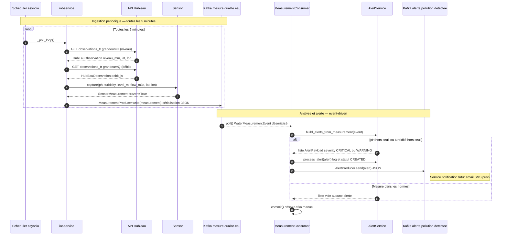
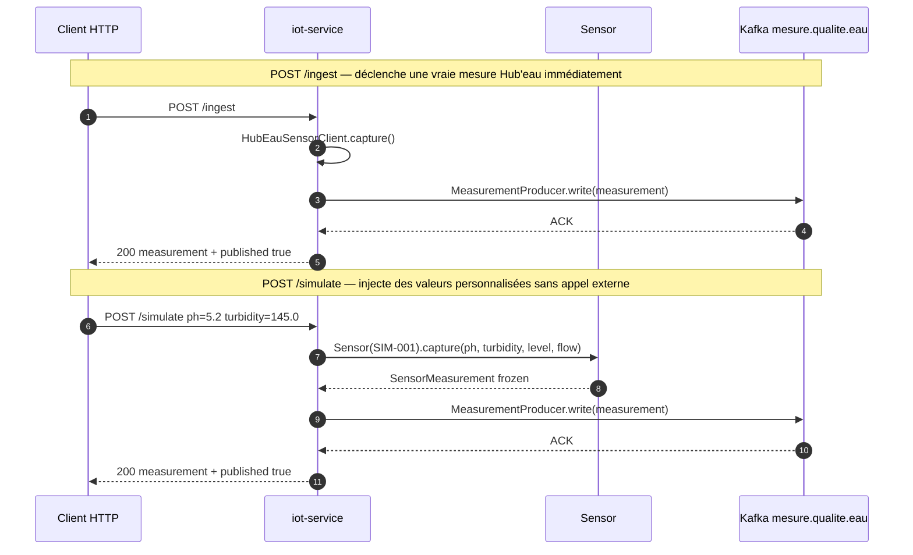

# UrbanHub — Plateforme Smart City de Qualité de l'Eau


> Architecture distribuée event-driven — deux micro-services Python qui collectent, publient et analysent la qualité de l'eau en temps réel via l'API Hub'eau officielle.

---

## Navigation — Cadre Diátaxis

Ce document suit le cadre **Diátaxis** : chaque section répond à un besoin de lecture différent.

| | **Apprendre** | **Travailler** |
|---|---|---|
| **Pratique** | [Tutoriel — démarrer en 5 min](#-tutoriel--démarrer-en-5-minutes) | [Guides pratiques](#-guides-pratiques) |
| **Théorique** | [Explication — pourquoi ces choix](#-explication--pourquoi-ces-choix) | [Référence technique](#-référence-technique) |

---

## Tutoriel — Démarrer en 5 minutes

Ce tutoriel guide pas à pas depuis un repo vide jusqu'à voir une alerte de pollution circuler dans Kafka.

### Pré-requis

- [Docker Desktop](https://docs.docker.com/desktop/) installé et en cours d'exécution
- [uv](https://docs.astral.sh/uv/) (gestionnaire de paquets Python)
- Git

### Étape 1 — Cloner et lancer la stack

```bash
git clone <url-du-repo>
cd urbanhub-water-quality

docker compose up --build -d
```

Docker lance 8 services (Kafka, iot-service, alert-service, Prometheus, Grafana, Loki, Promtail, Kafka-UI). Attendez que les health checks soient verts :

```bash
docker compose ps   # STATUS doit afficher "healthy" pour kafka, iot-service, alert-service
```

### Étape 2 — Déclencher une première mesure

```bash
curl -X POST http://localhost:8001/ingest
```

Réponse attendue :

```json
{
  "measurement": {
    "sensor_id": "F700000103",
    "ph": 7.4,
    "turbidity": 8.0,
    "level": 0.93,
    "flow": 252.0
  },
  "published": true
}
```

### Étape 3 — Simuler une alerte critique

```bash
curl -X POST "http://localhost:8001/simulate?ph=5.2&turbidity=145.0"
```

Le pH de 5.2 est en dessous du seuil critique (< 6.0). L'alert-service va détecter la violation et publier une alerte sur Kafka.

### Étape 4 — Observer le pipeline dans Kafka UI

Ouvrez [http://localhost:8080](http://localhost:8080) et naviguez vers :

- Topic `mesure.qualite.eau` → la mesure brute publiée par l'iot-service
- Topic `alerte.pollution.detectee` → l'alerte publiée par l'alert-service

### Étape 5 — Consulter les logs dans Grafana

Ouvrez [http://localhost:3000](http://localhost:3000) (admin / admin) pour voir les métriques et logs agrégés via Loki.

---

## Guides pratiques

### Lancer les tests

```bash
# iot-service
cd iot-service
uv run pytest tests/ -v

# alert-service
cd alert-service
uv run pytest tests/ -v

# Les deux services depuis la racine
cd iot-service && uv run pytest tests/ -v && cd ../alert-service && uv run pytest tests/ -v
```

### Installer les dépendances d'un service en local

```bash
# Installer les dépendances de développement
cd iot-service
uv sync --group dev

# Lancer le service en local (sans Docker)
PYTHONPATH=src uv run uvicorn iot_service.main:app --host 0.0.0.0 --port 8001 --reload
```

```bash
cd alert-service
uv sync --group dev
PYTHONPATH=src uv run uvicorn alert_service.main:app --host 0.0.0.0 --port 8000 --reload
```

### Ajouter un nouveau canal de publication (ex. fichier CSV)

Grâce au port `MeasurementWriter`, aucune modification des fichiers existants n'est nécessaire. Créez simplement une nouvelle implémentation :

```python
# iot-service/src/iot_service/adapters/csv_writer.py
from iot_service.domain.models import SensorMeasurement
from iot_service.domain.ports import MeasurementWriter
import csv

class CsvMeasurementWriter(MeasurementWriter):
    async def write(self, measurement: SensorMeasurement) -> None:
        with open("mesures.csv", "a") as f:
            writer = csv.writer(f)
            writer.writerow([measurement.timestamp, measurement.sensor_id, measurement.ph])

    async def start(self) -> None: pass
    async def stop(self) -> None: pass
```

Puis injectez-la dans `main.py` à la place de `MeasurementProducer`.

### Arrêter et nettoyer la stack Docker

```bash
docker compose down          # Arrête les conteneurs
docker compose down -v       # Arrête + supprime les volumes Kafka
```

---

## Référence technique

### Architecture des services

| Service | Rôle | Port | Stack technique |
|---|---|---|---|
| **iot-service** | Ingestion Hub'eau & publication Kafka | `8001` | FastAPI, aiokafka, urllib |
| **alert-service** | Analyse seuils & publication alertes | `8000` | FastAPI, aiokafka, Pydantic |
| **kafka** | Bus d'événements (mode KRaft, sans ZooKeeper) | `9092` | apache/kafka 3.7.1 |
| **kafka-ui** | Inspection des topics | `8080` | kafbat/kafka-ui |
| **prometheus** | Collecte de métriques | `9090` | prom/prometheus |
| **grafana** | Dashboards logs & métriques | `3000` | grafana/grafana |
| **loki** | Agrégation des logs Docker | `3100` | grafana/loki |
| **promtail** | Collecte et envoi des logs vers Loki | — | grafana/promtail |

### Flux de données — Diagramme de séquence

Le diagramme ci-dessous décrit le chemin complet d'une mesure depuis l'API Hub'eau jusqu'à la publication d'une alerte.



#### Chemin alternatif — Déclenchement REST manuel



### Topics Kafka

| Topic | Producteur | Consommateur | Contenu |
|---|---|---|---|
| `mesure.qualite.eau` | iot-service | alert-service | `WaterMeasurementEvent` — mesure brute |
| `alerte.pollution.detectee` | alert-service | *(futur)* | `AlertPayload` — alerte générée |

### Format des événements

#### `WaterMeasurementEvent` (topic `mesure.qualite.eau`)

```json
{
  "event_type": "mesure.qualite.eau",
  "event_id": "550e8400-e29b-41d4-a716-446655440000",
  "trace_id": "7f3a9c12-1b4e-4f6d-89a0-3c5d2f1e8b47",
  "capteur_id": "F700000103",
  "timestamp": "2026-06-29T14:52:01+00:00",
  "localisation": {
    "latitude": 48.8447,
    "longitude": 2.3655,
    "point_reference": "Station F700000103"
  },
  "mesures": {
    "ph": 7.4,
    "turbidite_ntu": 8.0,
    "temperature_c": 14.3,
    "niveau_m": 0.93,
    "debit_m3s": 0.252,
    "oxygene_dissous_mgl": 7.1
  },
  "qualite_signal": "GOOD",
  "firmware_version": "2.4.1"
}
```

#### `AlertPayload` (topic `alerte.pollution.detectee`)

```json
{
  "alert_id": "d1e2f3a4-b5c6-47d8-e9f0-a1b2c3d4e5f6",
  "event_id": "550e8400-e29b-41d4-a716-446655440000",
  "sensor_id": "F700000103",
  "timestamp": "2026-06-29T14:52:01+00:00",
  "severity": "CRITICAL",
  "type": "ph",
  "message": "pH critique detecte: 5.2",
  "localisation": {
    "latitude": 48.8447,
    "longitude": 2.3655,
    "point_reference": "Station F700000103"
  },
  "trace_id": "7f3a9c12-1b4e-4f6d-89a0-3c5d2f1e8b47",
  "metadata": {
    "overall_status": "CRITICAL",
    "source_event_type": "mesure.qualite.eau"
  }
}
```

### Seuils d'alerte

| Paramètre | WARNING | CRITICAL |
|---|---|---|
| pH | `< 6.5` ou `> 8.5` | `< 6.0` ou `> 9.0` |
| Turbidité | `> 10 NTU` | `> 50 NTU` |

### Endpoints REST

#### iot-service (port 8001)

| Méthode | Route | Description |
|---|---|---|
| `GET` | `/health` | Vérification d'état du service |
| `POST` | `/ingest` | Déclenche une ingestion Hub'eau immédiate |
| `POST` | `/simulate?ph=&turbidity=` | Publie une mesure simulée avec valeurs personnalisées |

#### alert-service (port 8000)

| Méthode | Route | Description |
|---|---|---|
| `GET` | `/health` | Vérification d'état du service |
| `POST` | `/alertes` | Crée une alerte directement via REST (HTTP 201) |

### Variables d'environnement

#### iot-service

| Variable | Défaut | Description |
|---|---|---|
| `KAFKA_BOOTSTRAP_SERVERS` | `localhost:9092` | Adresse du broker Kafka |
| `WATER_QUALITY_TOPIC` | `mesure.qualite.eau` | Topic de publication des mesures |
| `POLL_INTERVAL_SECONDS` | `300` | Intervalle de polling Hub'eau (secondes) |

#### alert-service

| Variable | Défaut | Description |
|---|---|---|
| `KAFKA_BOOTSTRAP_SERVERS` | `localhost:9092` | Adresse du broker Kafka |
| `WATER_QUALITY_TOPIC` | `mesure.qualite.eau` | Topic source des mesures |
| `POLLUTION_ALERT_TOPIC` | `alerte.pollution.detectee` | Topic de publication des alertes |
| `ALERT_APP_NAME` | `alert-service` | Nom de l'application (Pydantic Settings) |
| `ALERT_APP_VERSION` | `0.1.0` | Version (Pydantic Settings) |

### Structure du projet

```
urbanhub-water-quality/
├── iot-service/
│   ├── src/iot_service/
│   │   ├── domain/
│   │   │   ├── models.py       # SensorMeasurement — entité immuable (frozen dataclass)
│   │   │   └── ports.py        # MeasurementWriter — interface abstraite (ABC)
│   │   ├── sensor_service.py   # Sensor — état du capteur (SRP)
│   │   ├── hubeau_client.py    # Adaptateur API Hub'eau → SensorMeasurement
│   │   ├── kafka_producer.py   # MeasurementProducer — implémente MeasurementWriter
│   │   └── main.py             # FastAPI + poll_loop asyncio
│   └── tests/
├── alert-service/
│   ├── src/alert_service/
│   │   ├── ports.py            # AlertSender — interface abstraite (ABC)
│   │   ├── models.py           # Pydantic — AlertPayload, WaterMeasurementEvent
│   │   ├── service.py          # AlertService — logique d'analyse des seuils
│   │   ├── kafka_consumer.py   # MeasurementConsumer — consomme mesure.qualite.eau
│   │   ├── kafka_producer.py   # AlertProducer — implémente AlertSender
│   │   └── main.py             # FastAPI + lifespan consumer
│   └── tests/
├── monitoring/                 # Prometheus, Grafana, Loki, Promtail
├── docs/                       # Rapports et documentation technique
├── docker-compose.yml
└── README.md
```

---

## Explication — Pourquoi ces choix ?

### Pourquoi une architecture event-driven avec Kafka ?

L'iot-service et l'alert-service ne se connaissent pas. L'iot-service ne sait pas qu'un alert-service existe — il publie une mesure sur Kafka et c'est tout. Cette séparation permet :

- **L'indépendance des services** : chacun se déploie, se scale et tombe en panne séparément.
- **La résilience** : si l'alert-service est temporairement indisponible, les mesures s'accumulent dans Kafka sans perte (at-least-once delivery avec commit manuel).
- **L'extensibilité** : ajouter un nouveau consommateur (dashboard temps réel, export base de données, notification push) ne nécessite aucune modification des services existants.

Une architecture REST synchrone aurait couplé les deux services : une panne de l'alert-service bloquerait l'iot-service.

### Pourquoi SOLID et les ports & adapters (architecture hexagonale) ?

Avant le refactoring, `_poll_loop()` dans `main.py` connaissait Kafka en détail. Écrire un test unitaire de la boucle d'ingestion imposait de mocker `AIOKafkaProducer`. Avec le port `MeasurementWriter` :

```python
# Test sans Kafka — un simple mock suffit
class InMemoryWriter(MeasurementWriter):
    def __init__(self): self.written = []
    async def write(self, m): self.written.append(m)
    async def start(self): pass
    async def stop(self): pass
```

L'iot-service peut maintenant écrire vers un fichier, une base de données ou Kafka **sans modifier une seule ligne de logique applicative**.

Le même principe s'applique à `AlertSender` dans l'alert-service : pour envoyer les alertes par email au lieu de Kafka, il suffit d'implémenter `AlertSender`.

### Pourquoi `frozen=True` sur `SensorMeasurement` ?

Une mesure physique passée ne se modifie pas. `frozen=True` impose cette invariant au niveau du langage Python :

```python
measurement = sensor.capture(ph=7.4, ...)
measurement.ph = 5.0  # FrozenInstanceError — impossible par construction
```

Cela élimine une catégorie entière de bugs où une mesure serait altérée après sa création (par exemple dans un test, une transformation pipeline, ou une désérialisation incorrecte).

### CI / Qualité du code

| Outil | Rôle |
|---|---|
| `black` | Formatage automatique du code Python |
| `pytest` | Tests unitaires et d'intégration |
| GitHub Actions | Pipeline CI matriciel (iot-service + alert-service + Docker build) |
| Pre-commit hooks | Validation black avant chaque commit |
