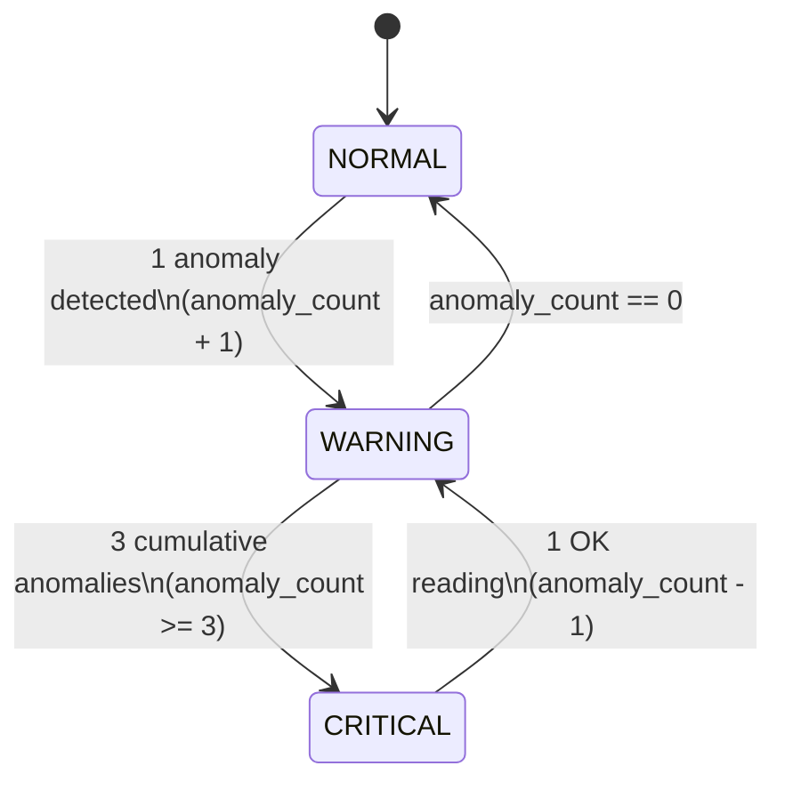

# 🚨 alert-service

> FastAPI microservice that consumes water-quality measurements from Kafka, runs a per-sensor state machine, persists everything to PostgreSQL + TimescaleDB, and broadcasts transitions in real-time via WebSocket.

[](https://www.python.org/)
[](https://fastapi.tiangolo.com/)
[](https://magicstack.github.io/asyncpg/)
[](#license)

---

## 📋 Table of Contents

- [What it does](#-what-it-does)
- [Architecture](#-architecture)
- [State machine](#-state-machine)
- [REST API Reference](#-rest-api-reference)
- [Drill-down endpoints](#-drill-down-endpoints)
- [WebSocket](#-websocket)
- [Project layout](#-project-layout)
- [Environment variables](#-environment-variables)
- [Development](#-development)
- [Testing](#-testing)
- [Design patterns](#-design-patterns)

---

## 🎯 What it does

`alert-service` is the **stateful brain** of UrbanHub. It:

1. **Consumes** `WaterMeasurementEvent` messages from the `mesure.qualite.eau` Kafka topic (background `MeasurementConsumer`).
2. **Updates** a per-sensor state machine (`NORMAL` → `WARNING` → `CRITICAL`) with hysteresis (3 consecutive anomalies to trigger CRITICAL).
3. **Persists** every measurement, every state transition, and every alert into PostgreSQL + TimescaleDB (hypertable for time-series).
4. **Publishes** alerts on the `alerte.pollution.detectee` Kafka topic when a state transitions.
5. **Broadcasts** state transitions in real time to connected dashboard clients via WebSocket (`/stream`).
6. **Exposes** a documented REST API (OpenAPI 3.0 + Swagger UI at `/docs`), including per-sensor drill-down endpoints.

All errors are returned in a single standardized JSON envelope (see [Error contract](#error-contract)).

---

## 🏛️ Architecture

```
┌────────────────┐                  ┌─────────────────┐
│  Kafka topic   │  WaterMeasure-   │  Measurement    │
│  mesure.qualite│──ment event────▶│  Consumer       │
│  .eau          │                  │  (aiokafka)     │
└────────────────┘                  └────────┬────────┘
                                             │
                                             ▼
                          ┌──────────────────────────────────┐
                          │        AlertService              │
                          │                                  │
                          │  ┌──────────────────────────┐    │
                          │  │ SensorProcessorRegistry  │    │
                          │  │  (one processor per id)  │    │
                          │  └──────────────────────────┘    │
                          │                                  │
                          │  ┌──────────────────────────┐    │
                          │  │ SensorStreamProcessor    │    │
                          │  │  State machine           │    │
                          │  │  NORMAL/WARNING/CRITICAL │    │
                          │  └──────────────────────────┘    │
                          │                                  │
                          │  ┌──────────────────────────┐    │
                          │  │   Repository layer       │    │
                          │  │   (PostgreSQL/Timescale) │    │
                          │  └──────────────────────────┘    │
                          │                                  │
                          │  ┌──────────────────────────┐    │
                          │  │   WebSocketHub           │◀───│── connected clients
                          │  │   (Observer pattern)     │    │   (dashboard)
                          │  └──────────────────────────┘    │
                          └──────────────────────────────────┘
                                             │
                                             ▼
                          ┌──────────────────────────────────┐
                          │   Kafka topic                    │
                          │   alerte.pollution.detectee      │
                          └──────────────────────────────────┘
                                             │
                                             ▼
                          ┌──────────────────────────────────┐
                          │   PostgreSQL + TimescaleDB       │
                          │   - sensors                      │
                          │   - measurements (HYPERTABLE)    │
                          │   - state_transitions            │
                          │   - alerts                       │
                          │   - current_sensor_state (view)  │
                          └──────────────────────────────────┘
```

---

## 🚦 State machine

`SensorStreamProcessor` is defined in [domain.py](file:///home/said/Bureau/xtreme-programming/alert-service/src/alert_service/domain.py) (DDD Domain Layer). The state machine is per-sensor, owned and managed by the [SensorProcessorRegistry](file:///home/said/Bureau/xtreme-programming/alert-service/src/alert_service/domain.py#L125).



- **1 anomaly**: transitions from `NORMAL → WARNING`.
- **3 cumulative anomalies**: transitions from `WARNING → CRITICAL` (enforces hysteresis to prevent flickering).
- **OK readings**: gradual decrement (`anomaly_count = max(0, anomaly_count - 1)`). Transitions back when count drops below thresholds.

The `previous_state` is preserved on every transition for the UI.

### 💾 Survives restarts (State Restoration)

To avoid state loss (where active anomaly counts and states are lost on service container restart):
1. During FastAPI **lifespan startup**, the application calls `alert_service.restore_states_from_db()`.
2. It reads the latest state and anomaly count of all active sensors from the `state_transitions` table.
3. It reconstructs and pre-populates the in-memory `SensorProcessorRegistry` with matching [SensorStreamProcessor](file:///home/said/Bureau/xtreme-programming/alert-service/src/alert_service/domain.py#L12) instances.
4. When new Kafka measurements arrive, the state machine resumes from its exact pre-restart state.

---

## 🔌 REST API Reference

| Method | Path | Description |
|--------|------|-------------|
| GET | `/health` | Liveness probe + component status |
| GET | `/sensors` | List every tracked sensor (state, anomaly_count, previous_state) |
| GET | `/sensors/{id}` | Get a single sensor's state |
| DELETE | `/sensors/{id}` | Reset a sensor (clears in-memory processor; next measurement starts fresh) |
| GET | `/stats` | Aggregated KPIs (totals, by_state, alerts, top_sensors) |
| GET | `/alerts` | List open alerts (default limit 50) |
| WS | `/stream` | Subscribe to state_transition events (see below) |
| GET | `/_echo` | Debug: echo trace_id |

Full OpenAPI at <http://localhost:8000/docs>.

---

## 🔍 Drill-down endpoints

Three new endpoints added in v0.2 to power the dashboard's per-sensor drawer.

| Method | Path | Purpose | Response |
|--------|------|---------|----------|
| GET | `/sensors/{id}/metadata` | Catalogue + state + last_measurement_at + data_source + firmware | `SensorMetadataView` |
| GET | `/sensors/{id}/measurements?hours=24&limit=500` | Time-series (oldest first, capped at 2000) | `MeasurementSeriesResponse` |
| GET | `/sensors/{id}/alerts?limit=20&only_open=false` | Recent alerts for this sensor | `AlertListResponse` |

All three return:
- **404** if the sensor is unknown
- **503** if the DB is unreachable
- **422** on validation error (e.g. `hours > 168`)

### Example

```bash
# Get full metadata for SEINE-VITRY-001
curl http://localhost:8000/sensors/SEINE-VITRY-001/metadata

# Get the last 24h of measurements
curl 'http://localhost:8000/sensors/SEINE-VITRY-001/measurements?hours=24'

# Get the last 10 alerts (open + closed)
curl 'http://localhost:8000/sensors/SEINE-VITRY-001/alerts?limit=10'
```

---

## 🔌 WebSocket

Connect to `ws://<host>:8000/stream`.

> The endpoint is `/stream`, not `/ws` — the latter would collide with the `GET /sensors/{sensor_id}` path-parametrized route (FastAPI would match the GET as a sensor lookup). The nginx proxy on the dashboard also uses `/api/stream`.

### Server messages

**Welcome** (sent immediately on connect):
```json
{
  "event_type": "welcome",
  "data": {"message": "Connected to UrbanHub alert-service"},
  "timestamp": "2026-07-01T10:00:00Z"
}
```

**State transition** (broadcast on every transition):
```json
{
  "event_type": "state_transition",
  "data": {
    "sensor_id": "SEINE-VITRY-001",
    "previous_state": "NORMAL",
    "new_state": "WARNING",
    "anomaly_count": 1
  },
  "timestamp": "2026-07-01T10:00:00Z"
}
```

The client doesn't need to send anything; the connection is one-way (server → client).

### Client example (JS)

```js
const ws = new WebSocket('ws://localhost:8000/stream');
ws.onmessage = (msg) => {
  const evt = JSON.parse(msg.data);
  if (evt.event_type === 'state_transition') {
    console.log(`${evt.data.sensor_id}: ${evt.data.previous_state} → ${evt.data.new_state}`);
  }
};
```

---

## ⚠️ Error contract

Every error response uses the same JSON envelope (`ErrorResponse` model in `models.py`):

```json
{
  "error": "SENSOR_NOT_FOUND",
  "message": "Sensor 'X' is not in the catalogue.",
  "trace_id": "f47ac10b-...",
  "timestamp": "2026-07-01T10:00:00Z",
  "path": "/sensors/X/metadata",
  "details": {"sensor_id": "X"}
}
```

The `trace_id` is propagated end-to-end (HTTP header `X-Trace-Id` → Kafka header → DB column → log records).

---

## 📁 Project layout

```
alert-service/
├── README.md
├── pyproject.toml
├── Dockerfile
├── src/
│   └── alert_service/
│       ├── __init__.py
│       ├── main.py              ← FastAPI app + lifespan + endpoints
│       ├── domain.py            ← SensorStreamProcessor + SensorProcessorRegistry (DDD Domain Layer)
│       ├── service.py           ← AlertService (DDD Application Layer)
│       ├── repositories.py      ← ABCs + Postgres*Repository implementations (Infrastructure Layer)
│       ├── models.py            ← Pydantic models (request, response, domain)
│       ├── websocket.py         ← WebSocketHub (Observer pattern)
│       ├── kafka_consumer.py    ← MeasurementConsumer (aiokafka)
│       ├── kafka_producer.py    ← AlertProducer
│       ├── middleware.py        ← TraceIdMiddleware
│       ├── error_handlers.py    ← Standardized error envelope
│       ├── exceptions.py        ← Domain exceptions
│       ├── config.py            ← Settings (pydantic-settings)
│       └── openapi_config.py    ← OpenAPI metadata
└── tests/
    ├── test_api.py              ← HTTP API test suite
    ├── test_integration.py      ← Integration test (State restoration check)
    ├── test_measurement_bridge.py ← Raw message transformation verification
    ├── test_openapi_contract.py ← Swagger specification checks
    └── test_websocket.py        ← Real-time broadcast tests
```

---

## ⚙️ Environment variables

| Variable | Default | Description |
|----------|---------|-------------|
| `DATABASE_URL` | *(empty)* | PostgreSQL connection string; if empty the service runs in-memory |
| `KAFKA_BOOTSTRAP_SERVERS` | `localhost:9092` | Kafka brokers |
| `WATER_QUALITY_TOPIC` | `mesure.qualite.eau` | Input topic (consumed) |
| `POLLUTION_ALERT_TOPIC` | `alerte.pollution.detectee` | Output topic (produced) |
| `KAFKA_CONSUMER_GROUP` | `alert-service-group` | Consumer group id |
| `ALERT_KAFKA_AUTO_OFFSET_RESET` | `latest` | Where to start when no committed offset exists |
| `ALERT_WEBSOCKET_PATH` | `/stream` | WebSocket endpoint path |

---

## 🛠️ Development

```bash
cd alert-service
uv sync
PYTHONPATH=src uv run uvicorn alert_service.main:app --reload
```

The `--reload` flag picks up code changes in `src/`.

---

## 🧪 Testing

```bash
cd alert-service
PYTHONPATH=src uv run pytest tests/ -v
```

Tests cover the state machine, the WebSocket hub, and the new drill-down endpoints (happy path, 404, 503, validation).

---

## 🎨 Design patterns

| Pattern | Where | Why |
|---------|-------|-----|
| **State Machine** | `SensorStreamProcessor` | Encode transition rules in one place |
| **Repository** | `Postgres*Repository` (ABC + concrete) | Decouple persistence from business logic |
| **Observer** | `WebSocketHub` | Push transitions to N dashboard clients |
| **Singleton** | module-level `alert_service` | Shared across consumer, API, lifespan |
| **Factory** | `create_pool(database_url)` | Centralise connection-pool creation |
| **Adapter** | (consumer converts Kafka JSON → WaterMeasurementEvent) | Translate external schema to our domain |

---

## 🔗 See also

- [iot-service](../iot-service/) — produces the measurements we consume.
- [dashboard](../dashboard/) — consumes the REST + WS APIs.
- [docs/architecture.md](https://github.com/chrfsa/xtreme-programming/blob/main/docs/architecture.md) — system-wide architecture.
