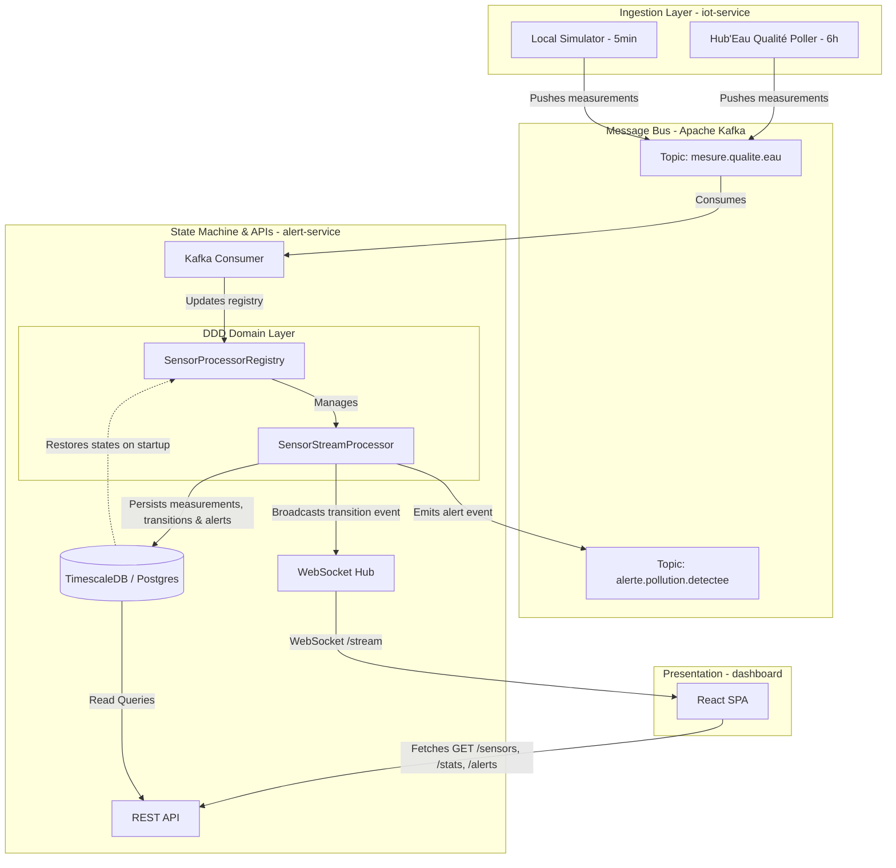
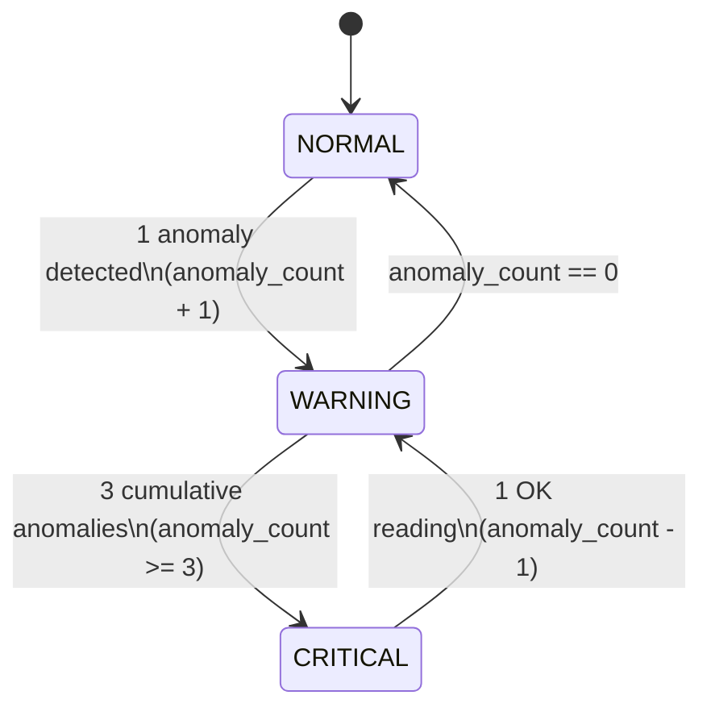

# UrbanHub — Architecture

> High-level architectural overview. For UML diagrams and ADRs, see the Obsidian vault
> at `~/Bureau/vault/10 - Projects/UrbanHub/`.

---

## 1. Goals & non-goals

**Goals**
- Demonstrate an event-driven, multi-service Smart City platform.
- Ingest **real** water-quality data (Hub'Eau) **and** synthetic data through the same pipeline.
- Detect anomalies with a state machine (NORMAL → WARNING → CRITICAL).
- Persist time-series efficiently with TimescaleDB.
- Push state transitions in real time to a SPA dashboard.
- Provide per-sensor drill-down (chart + table + alerts).

**Non-goals (yet)**
- Multi-tenant or auth (planned v0.4).
- ML-based anomaly detection (planned v0.5).
- Kubernetes manifests (planned v0.6).
- Other Smart City domains (traffic, noise, energy) — designed for it, not built.

---

## 2. Component overview



---

## 3. Data flow

### 3.1 Real data (Hub'Eau)
```
Hub'Eau REST API  ──▶  iot-service/HubEauQualiteClient  (Adapter)
                       ↓
                     Fetch 5 parameters × 6 stations in parallel (ThreadPoolExecutor)
                       ↓
                     Map to WaterMeasurementEvent (data_source="real")
                       ↓
                     aiokafka producer
                       ↓
                     Topic: mesure.qualite.eau
                       ↓
                     alert-service consumer
                       ↓
                     SensorStreamProcessor.update()
                       ↓
                     ┌─────────────┴──────────────┐
                     ▼                            ▼
            state_transitions table    measurements table
                     │
                     ▼  (if NORMAL → WARNING or WARNING → CRITICAL)
            build AlertPayload
                     │
                     ▼
            alerts table  +  Kafka topic alerte.pollution.detectee
                                          │
                                          ▼
                                (downstream consumers, e.g. notification)
```

Cadence: **every 6 hours** per station (configurable via `QUALITY_POLL_INTERVAL_SECONDS`).
Hub'Eau publishes analyses at lab frequency (~1×/month per parameter), so 6h polling is plenty.

### 3.2 Simulated data
```
iot-service/simulator/SimulationOrchestrator
  ↓ every 5 minutes (configurable via SIMULATOR_INTERVAL_SECONDS)
  For each of 6 simulated sensors (excluded from Hub'Eau mapping):
  ↓
  MeasurementGenerator  (diurnal cycle + random walk + pollution events)
  ↓
  WaterMeasurementEvent (data_source="simulated")
  ↓
  Same Kafka topic as Hub'Eau
  ↓
  Same downstream pipeline
```

### 3.3 Why a single `iot-service`?

Earlier versions had `sensor-simulator` as a separate service. We merged them because:
- Both share the same Kafka producer, the same domain model, the same exclusions.
- The simulator is essentially a "fallback adapter" for sensors Hub'Eau doesn't cover.
- A single deployment is simpler to operate, monitor, and reason about.

The split is **logical** (Hub'Eau vs Simulator modules), not **physical** (separate containers).

---

## 4. State machine

`SensorStreamProcessor` in [domain.py](file:///home/said/Bureau/xtreme-programming/alert-service/src/alert_service/domain.py) (DDD Domain Layer):



- Each sensor has its own processor instance (held in [SensorProcessorRegistry](file:///home/said/Bureau/xtreme-programming/alert-service/src/alert_service/domain.py#L125)).
- **Persistence of state**: Every transition is written to the `state_transitions` table in PostgreSQL.
- **Survives restarts**: On startup, the service runs `restore_states_from_db()` in lifespan, pre-populating the in-memory registry with processors populated with their last-known state and anomaly count. This ensures zero state loss of the sliding anomaly window across container restarts.

---

## 5. Persistence

### 5.1 Tables

| Table | Engine | Purpose |
|-------|--------|---------|
| `sensors` | PostgreSQL | Catalogue (id, name, lat, lon, point_reference) |
| `measurements` | **TimescaleDB hypertable** | Time-series, chunked per day |
| `state_transitions` | PostgreSQL | History of state changes per sensor |
| `alerts` | PostgreSQL | All alerts (status: OPEN / ACK / CLOSED) |
| `measurements_hourly` | **TimescaleDB continuous aggregate** | 1 point / hour / sensor (auto-refreshed) |
| `measurements_daily` | **TimescaleDB continuous aggregate** | 1 point / day / sensor (auto-refreshed) |
| `current_sensor_state` | View | Latest state per sensor (denormalized for fast queries) |

### 5.2 Hypertable chunks
- `measurements` is partitioned into 1-day chunks automatically.
- Old chunks (>90 days) are dropped by a TimescaleDB retention policy.
- Queries that filter on `timestamp` (e.g. the last 24h) only scan the relevant chunks.

### 5.3 Continuous aggregates
- `measurements_hourly` and `measurements_daily` are pre-computed views.
- Refreshed automatically (hourly / daily).
- Future-proofs the dashboard for long-term charts without scanning millions of rows.

---

## 6. Real-time push

### 6.1 WebSocket
- alert-service exposes `WS /stream` (note: `/ws` collides with `/sensors/{id}` path-param, so we use `/stream`).
- Every state transition is broadcast as a JSON message:
  ```json
  {
    "event_type": "state_transition",
    "data": {
      "sensor_id": "SEINE-VITRY-001",
      "previous_state": "NORMAL",
      "new_state": "WARNING",
      "anomaly_count": 1
    },
    "timestamp": "2026-07-01T10:00:00Z"
  }
  ```
- On `welcome`, the dashboard displays "Temps réel · WS connecté".
- The dashboard re-fetches `/sensors`, `/stats`, `/alerts` on every event (KISS — small JSON, fast network).

### 6.2 Drawer refresh
- When the user opens a sensor's drill-down drawer, the dashboard fires 3 parallel calls:
  - `GET /sensors/{id}/metadata`
  - `GET /sensors/{id}/measurements?hours=24`
  - `GET /sensors/{id}/alerts?limit=10`
- Future enhancement: subscribe the drawer to WS events for that sensor.

---

## 7. Drill-down endpoints

Three new REST endpoints (added in v0.2):

| Method | Path | Purpose |
|--------|------|---------|
| GET | `/sensors/{id}/metadata` | Catalogue row + state + last_measurement_at + data_source + firmware |
| GET | `/sensors/{id}/measurements?hours=24&limit=500` | Time-series (oldest first, capped at 2000) |
| GET | `/sensors/{id}/alerts?limit=20&only_open=false` | Recent alerts for this sensor |

All three return 404 if the sensor is unknown and 503 if the DB is unreachable.

---

## 8. Observability

- **Logs**: Python `logging` → stdout → Promtail → Loki → Grafana.
  - Every log line carries a `trace_id` (via `TraceIdMiddleware`).
- **Metrics**: `/metrics` (TODO) on each Python service, scraped by Prometheus.
- **Traces**: `X-Trace-Id` header propagated:
  - HTTP request → response body + response header
  - Kafka message → Kafka header
  - DB row → `trace_id` column

---

## 9. Design patterns used

| Pattern | Where | Why |
|---------|-------|-----|
| **State Machine** | `SensorStreamProcessor` | Encode transition rules in one place |
| **Repository** | `Postgres*Repository` | Decouple persistence from business logic |
| **Adapter** | `HubEauQualiteClient` | Translate external JSON to our domain model |
| **Observer** | `WebSocketHub` | Push transitions to N dashboard clients |
| **Strategy** | Hub'Eau vs Simulator (in iot-service) | Same Kafka output, different sources |
| **Singleton** | `alert_service` (module-level) | Shared across consumer, API, scheduler |
| **ABC / Dependency Inversion** | `SensorRepository(abc.ABC)` | Swap implementation in tests |
| **Factory** | `create_pool(database_url)` | Centralise connection-pool creation |

---

## 10. SOLID scorecard

| Principle | Where it's applied |
|-----------|---------------------|
| **S**ingle Responsibility | Each class has one job (Processor: state machine, Registry: lookup, Repository: persistence, Hub: broadcast) |
| **O**pen/Closed | Add a `MongoRepository` without changing `AlertService` |
| **L**iskov Substitution | `PostgresSensorRepository` is interchangeable with any other `SensorRepository` impl |
| **I**nterface Segregation | Small focused ABCs (`SensorRepository`, `MeasurementRepository`, etc.) |
| **D**ependency Inversion | `AlertService` depends on ABCs, not on `asyncpg` |

---

## 11. Open questions / future work

- Authentication & multi-tenancy (planned v0.4)
- ML-based anomaly detection (planned v0.5)
- Kubernetes manifests (planned v0.6)
- Multi-domain (traffic, noise) — the abstractions are in place, just need adapters
- Drawer auto-refresh on WS events
- URL hash sync (`#sensor=SEINE-XXX-NNN`) for shareable links
