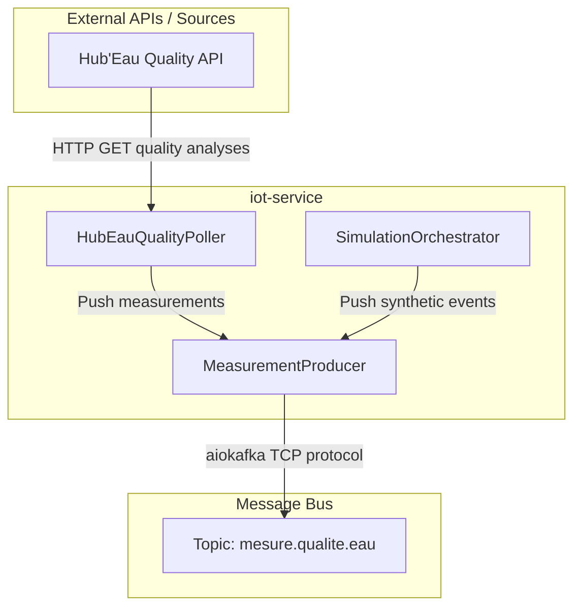

# 🌐 iot-service

> FastAPI microservice that produces **water-quality measurements** to Kafka.
> Combines two strategies in one app:
> 1. **Real data**: polls the official **Hub'Eau API** (6 stations along the Seine).
> 2. **Synthetic data**: runs a local sensor simulator for the 6 sensors Hub'Eau doesn't cover.
>
> The output is the same `WaterMeasurementEvent` payload on the same Kafka topic — the downstream `alert-service` is unaware of the source.

[](https://www.python.org/)
[](https://fastapi.tiangolo.com/)
[](#license)

---

## 📋 Table of Contents

- [What it does](#-what-it-does)
- [Architecture](#-architecture)
- [Data sources](#-data-sources)
- [Polling schedule](#-polling-schedule)
- [Hub'Eau API](#-hubeau-api)
- [Local simulator](#-local-simulator)
- [API Reference](#-api-reference)
- [Project layout](#-project-layout)
- [Environment variables](#-environment-variables)
- [Development](#-development)
- [Testing](#-testing)

---

## 🎯 What it does

`iot-service` is the **single data-source service** for UrbanHub. It runs two background loops in parallel:

1. **Hub'Eau poller** — every 6 hours, fetches the latest water-quality analysis for 6 real stations
   (pH, dissolved O₂, temperature, DCO, ammonium). Maps Hub'Eau's JSON schema to UrbanHub's
   `WaterMeasurementEvent` and publishes on Kafka.
2. **Local simulator** — every 5 minutes, generates synthetic but realistic measurements for
   the 6 other sensors (those without a real Hub'Eau mapping). Uses a diurnal cycle + random
   walk + occasional pollution events.

It exposes only a health probe (`GET /health`) since it acts as a pure Kafka producer (background worker) with no other business REST endpoints.

> **One iot-service to rule them all** — both real Hub'Eau ingestion and the local simulator live in the same FastAPI app. The split is logical (Hub'Eau vs Simulator modules), not physical (separate containers).

---

## 🏛️ Architecture



---

## 🛰️ Data sources

| Sensor ID | Source | Cadence | Parameters |
|-----------|--------|---------|------------|
| SEINE-VITRY-001 | 🌐 Hub'Eau `03112331` | 6h | pH, O₂, T°, DCO, ammonium |
| SEINE-CHARENTON-002 | 🌐 Hub'Eau `03112328` | 6h | idem |
| SEINE-BERCY-003 | 🌐 Hub'Eau `03081000` | 6h | idem |
| SEINE-AUSTERLITZ-004 | 🌐 Hub'Eau `03081270` | 6h | idem |
| SEINE-CONCORDE-006 | 🌐 Hub'Eau `03081570` | 6h | idem |
| SEINE-COLOMBES-012 | 🌐 Hub'Eau `03083450` | 6h | idem |
| SEINE-ILES-LOUVRE-005 | 🎲 Simulated | 5min | pH, O₂, T°, turbidity, level, flow |
| SEINE-ALMA-007 | 🎲 Simulated | 5min | idem |
| SEINE-TOUR-EIFFEL-008 | 🎲 Simulated | 5min | idem |
| SEINE-IENA-009 | 🎲 Simulated | 5min | idem |
| SEINE-BILLANCOURT-010 | 🎲 Simulated | 5min | idem |
| SEINE-SURESNES-011 | 🎲 Simulated | 5min | idem |

Mapping is in `station_mapping.py` (Hub'Eau code → UrbanHub sensor_id).

---

## ⏱️ Polling schedule

| Loop | Default | Env var |
|------|---------|---------|
| Hub'Eau quality (6 stations) | 6h | `QUALITY_POLL_INTERVAL_SECONDS` |
| Local simulator (6 sensors) | 5min | `SIMULATOR_INTERVAL_SECONDS` |

Jitter is added to avoid thundering-herd effects (e.g. `±30s` on the simulator).

---

## 🌊 Hub'Eau API

`HubEauQualiteClient` adapts the official Hub'Eau v2 `qualite_rivieres` endpoint to UrbanHub's domain model.

**5 parameters per station** (Sandre codes):
- `1302` — pH
- `1301` — Temperature
- `1311` — Dissolved oxygen
- `1314` — DCO (chemical oxygen demand)
- `1335` — Ammonium

The client fetches the 5 parameters **in parallel** (ThreadPoolExecutor) because Hub'Eau sometimes hangs on individual parameter queries. Worst-case latency is bounded to `~timeout` instead of `N × timeout`.

> **Why 6h polling?** Hub'Eau publishes lab analyses at ~1×/month per station. Faster polling would waste API quota without yielding new data.

---

## 🎲 Local simulator

`SimulationOrchestrator` (in `simulator/`) generates synthetic measurements using:

- **Diurnal cycle** — pH and O₂ vary with the time of day.
- **Random walk** — small drift between measurements.
- **Pollution events** — occasional spikes (low pH, high turbidity).

The simulator **skips** any sensor_id listed in `SIMULATOR_EXCLUDE_SENSORS` (default: the 6 Hub'Eau sensor_ids), so each sensor has exactly one source of truth.

---

## 🔌 API Reference

| Method | Path | Description |
|--------|------|-------------|
| GET | `/health` | Liveness + component status + metrics |
| POST | `/api/sensors/{sensor_id}/metrics` | HTTP Ingestion Gateway: Allows physical sensors to push metrics directly to Kafka |

Full OpenAPI at <http://localhost:8001/docs>.

---

## 📁 Project layout

```
iot-service/
├── README.md
├── pyproject.toml
├── Dockerfile
├── src/
│   └── iot_service/
│       ├── __init__.py
│       ├── config.py                ← Centralized env-var settings
│       ├── main.py                  ← FastAPI app, lifespan spawns background loops
│       ├── kafka_producer.py        ← Unified aiokafka producer
│       ├── hubeau_qualite_client.py ← Adapter for Hub'Eau water quality (v2)
│       ├── station_mapping.py       ← Hub'Eau code → UrbanHub sensor_id
│       ├── quality_poller.py        ← Hub'Eau quality polling loop (6h)
│       ├── sensor_service.py        ← Core simulation capture structures
│       └── simulator/               ← Local sensor simulator (5min)
│           ├── __init__.py
│           ├── sensors.py           ← 12 SensorProfile (id, lat, lon, baseline)
│           ├── generator.py         ← MeasurementGenerator (diurnal + random walk)
│           └── orchestrator.py      ← SimulationOrchestrator (cadence + exclusions)
└── tests/
```

---

## ⚙️ Environment variables

| Variable | Default | Description |
|----------|---------|-------------|
| `KAFKA_BOOTSTRAP_SERVERS` | `localhost:9092` | Kafka brokers (comma-separated) |
| `WATER_QUALITY_TOPIC` | `mesure.qualite.eau` | Output topic |
| `ALERT_SERVICE_URL` | `http://localhost:8000` | Downstream alert-service URL |
| `QUALITY_POLL_INTERVAL_SECONDS` | `21600` | Hub'Eau quality poll (6h) |
| `SIMULATOR_INTERVAL_SECONDS` | `300` | Local simulator cadence (5min) |
| `SIMULATOR_JITTER_SECONDS` | `30` | Random jitter on simulator interval |
| `SIMULATOR_EXCLUDE_SENSORS` | `SEINE-VITRY-001,...` | Comma-separated sensor_ids skipped by the simulator |

---

## 🛠️ Development

```bash
cd iot-service
uv sync
PYTHONPATH=src uv run uvicorn iot_service.main:app --reload --port 8001
```

The `--reload` flag picks up code changes in `src/`.

---

## 🧪 Testing

```bash
cd iot-service
PYTHONPATH=src uv run pytest tests/ -v
```

Tests cover:
- `HubEauQualiteClient` (parallel fetch, partial data, HTTP errors, malformed JSON)
- `station_mapping` (uniqueness, format, lookup functions)
- `SimulationOrchestrator` (exclusion logic, env-var override)

---

## 🔗 See also

- [alert-service](../alert-service/) — consumes what we produce.
- [dashboard](../dashboard/) — visualizes the data.
- [docs/architecture.md](https://github.com/chrfsa/xtreme-programming/blob/main/docs/architecture.md) — system-wide architecture.
- [Hub'Eau API docs](https://hubeau.eaufrance.fr/page/api-qualite-cours-deau)
